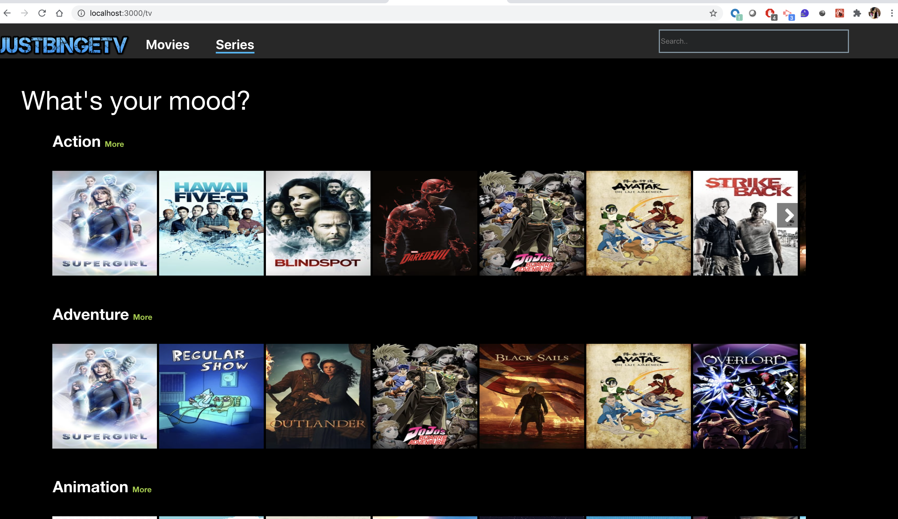

This project was bootstrapped with [Create React App](https://github.com/facebook/create-react-app).

## Available Scripts

In the project directory, you can run:

### `npm start`

Runs the app in the development mode. 
Open [http://localhost:3000](http://localhost:3000) to view it in the browser.

<b>About the application:</b>
Displays list of movies in slider of different genres sorted in accordance with user rating. 
Details about the movie can be seen by clicking on the more buttonn and by hovering over the movie/series tile the trailer starts playing.
Search bar can be used to search for any movie/series

<b>Some screenshots of the application: </b>

Click on movies to see all the latest movies  sorted in genres and displayed in the order of rating , highest rated being the first in the list of genre

Click on series to see all the latest series  sorted in genres and displayed in the order of rating , highest rated being the first in the list of genre

Hover on any of the tiles to see the player in action. Related trailer for movies or series start playing. On moving away from tile the player stops

Click on the dots of the tile of movie/series to see the details of the movies/series-

Click on more on the side of genre like Action to see all the available movies/series in that genre. On Hovering over the tile the trailer is played

